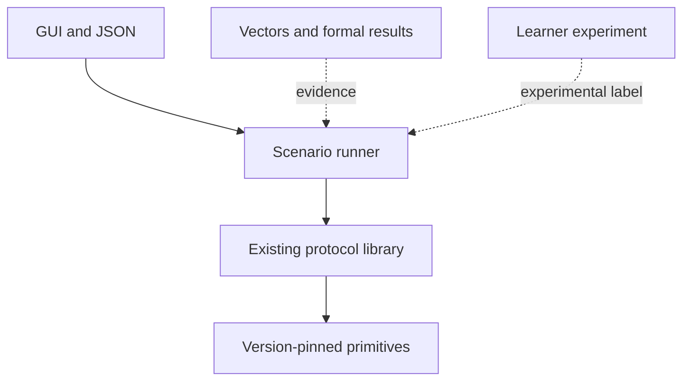

# Protocol laboratory

Kemdara measures both individual primitives and production-shaped protocol scenarios. It deliberately reuses existing protocol specifications and libraries instead of inventing a new wire protocol.

These scenarios are executable study material, not audited production releases. Independent audits, certification, hosted infrastructure, and operational support are outside Kemdara's open-source learning scope. Downstream products can perform those steps if they choose to deploy a studied profile.

## Protocols by purpose

| Product shape | Established protocol | Kemdara scenario |
| --- | --- | --- |
| Client/server API or service transport | TLS 1.3 (RFC 8446) | Full in-memory handshake, authentication, application records, resumption, and failure cases |
| Asynchronous encryption to one recipient | HPKE (RFC 9180) | Sender/recipient setup plus multiple message and parameter sizes |
| Group end-to-end messaging | MLS (RFC 9420) | Group creation, add/remove/update, commit size, and epoch transition costs |
| Custom two-party end-to-end channel | Stable Noise revision 34 patterns | Compare message count, authentication knowledge, identity exposure, wire bytes, and transport setup |

The first implemented protocol scenarios are:

- `Noise_NN_25519_ChaChaPoly_BLAKE2s`: two handshake messages and one encrypted 1 KiB transport message. It is intentionally unauthenticated.
- `Noise_XX_25519_ChaChaPoly_BLAKE2s`: three handshake messages, static-key exchange and verification, and one encrypted 1 KiB transport message. It provides mutual static-key authentication, but the application still decides whether those keys are trusted.

Both are marked `experimental` because Kemdara's current Rust Noise provider states that it has not received a formal audit. The protocol pattern may be stable while implementation assurance remains a separate question.

## Required separation

Primitive and protocol results must remain separate. A Noise XX result includes multiple DH operations, transcript hashing, AEAD work, key generation, and state transitions; comparing it directly with a single X25519 operation would be misleading.

## Scenario roadmap

1. Noise NN and XX: complete in-memory handshake and encrypted transport verification.
2. Noise NK and IK: measure the latency/identity tradeoff when the responder's static key is known in advance.
3. TLS 1.3: local client/server handshake, certificate verification, encrypted records, and explicit failure cases.
4. HPKE: base and authenticated modes with recorded envelope sizes.
5. MLS: group scenarios once a narrowly scoped, interoperable adapter is practical.
6. Experimental hybrid/PQ protocol profiles only after their exact draft or standard is pinned.

## Evidence required for a Kemdara scenario

Kemdara does not require a costly independent audit before an educational adapter can be merged. It does require:

1. A precise public specification/profile and version, or a prominent `original experiment` label.
2. A pinned reusable implementation; Kemdara must not rewrite the cryptographic primitive.
3. A successful complete transcript or round-trip check.
4. Negative tests for corrupt, truncated, reordered, replayed, or wrongly authenticated messages where applicable.
5. Official vectors or cross-implementation transcripts when available.
6. Explicit authentication, confidentiality, forward-secrecy, identity-hiding, and replay caveats.
7. Cross-platform CI and a reproducible workload definition.

An audit can raise an implementation's evidence level later. Its absence must remain visible but does not prevent study.

## Visualizations that matter at protocol level

- handshake timeline: message flights, CPU time, bytes, and the point where each identity becomes authenticated;
- latency distribution: P50/P95/P99 rather than only a mean;
- jitter/noise: coefficient of variation and min-to-max range;
- throughput curve: message size versus MiB/s;
- network sensitivity: round-trip delay and packet loss versus completion time/failure rate;
- resource profile: peak memory, allocations, key sizes, ciphertext expansion, and total wire bytes;
- security-state view: confidentiality, authentication, forward secrecy, and replay exposure at every flight.

These measurements belong in versioned JSON with the machine, compiler, implementation version, profile, build flags, and actual sample count.

## If someone deploys a scenario

Deployment is a separate downstream responsibility. At minimum it needs a concrete threat model, identity enrollment and recovery, secure key storage, protocol versioning, replay/downgrade handling, fuzzing, dependency response, reproducible releases, and external review appropriate to its risk. Kemdara will not display a “production secure” badge based on benchmark or round-trip success.
