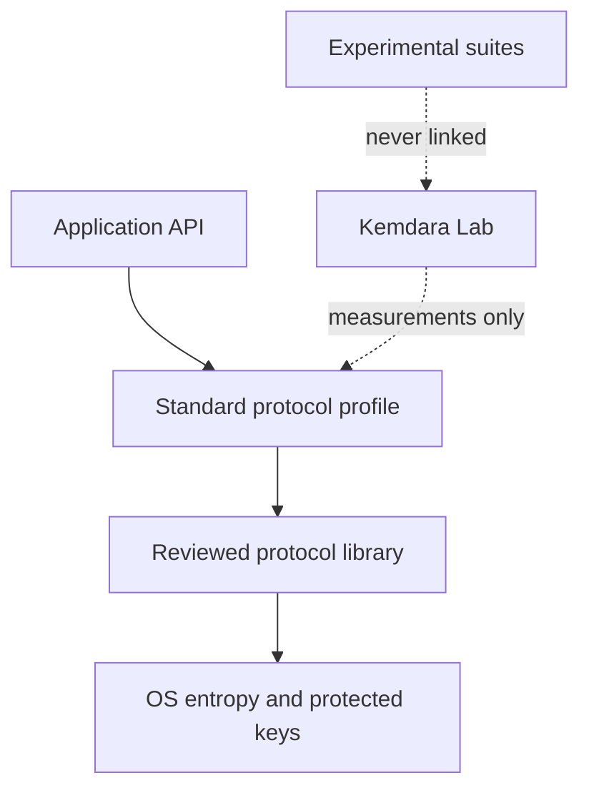

# Production protocol track

Kemdara Lab measures cryptographic workloads. Turning those adapters directly into a wire protocol would create an unnecessary security risk. The production track must instead profile an established protocol, use a reviewed implementation, and keep experimental suites outside the production dependency graph.

## Choose the product before the protocol

| Product shape | Production baseline | Kemdara's role |
| --- | --- | --- |
| Client/server API or service transport | TLS 1.3 (RFC 8446) through `rustls` | Measure handshake, resumption, records, and failure behavior around the library |
| Asynchronous encryption to one recipient | HPKE (RFC 9180) through a maintained interoperable implementation | Test profiles, vectors, envelope size, and misuse cases |
| Group end-to-end messaging | MLS (RFC 9420), for example through OpenMLS | Measure group operations and validate application-level policies |
| Custom two-party end-to-end channel | A fixed stable Noise pattern only after choosing an audited implementation and completing interoperability review | Visualize transcripts and measure network behavior; do not implement the handshake primitives in Kemdara |

The recommended first production target is a TLS 1.3 client/server channel. It has a standardized wire format, mature identity and certificate machinery, and an audited Rust implementation. A Noise channel is attractive for a tightly controlled peer-to-peer product, but the commonly used Rust `snow` implementation explicitly states that it has not received a formal audit; that blocks Kemdara from presenting it as the default production path.

## Required separation

The production package must expose intent-level operations such as `connect`, `accept`, `send`, `receive`, `rotate_identity`, and `close`. It must not expose free-form choices of KEM, hash, signature, nonce, or handshake pattern. Algorithm agility belongs in a versioned protocol profile, not in user-controlled runtime settings.

## Version 1 profile proposal

Start with one narrow service profile:

- TLS 1.3 only, backed by `rustls` and its supported cryptographic provider.
- Mutual authentication when both peers are managed; server authentication plus an application credential otherwise.
- No early data in version 1, avoiding replay-sensitive 0-RTT behavior.
- Length-bounded application frames with explicit content type and protocol version.
- Monotonic connection/session identifiers for observability, never reused as cryptographic nonces.
- Private keys loaded through a keystore abstraction; no secret key is serialized into benchmark JSON or logs.
- A fixed error taxonomy that does not reveal secret-dependent detail to a remote peer.

Post-quantum and hybrid handshakes remain in the lab until an interoperable standards profile and suitable reviewed provider exist. They should be tested as a whole protocol transcript—not promoted because their component microbenchmarks pass.

## Production admission gates

1. Write a threat model covering peers, authentication, replay, compromise, metadata, denial of service, and recovery.
2. Freeze the normative protocol/profile and wire-format references.
3. Define identity enrollment, rotation, revocation, storage, backup, and device-loss behavior.
4. Make downgrade, replay, nonce reuse, truncation, reordering, and malformed-frame tests mandatory.
5. Pass official vectors and cross-implementation tests.
6. Add state-machine property tests, coverage-guided fuzzing, dependency auditing, an SBOM, and reproducible release builds.
7. Measure real network handshakes under latency, loss, reordering, concurrency, and large-message pressure.
8. Commission an independent design review and implementation audit, resolve findings, and publish a security policy.
9. Run a staged deployment with telemetry that contains no keys, plaintext, or peer-identifying secrets.
10. Only then remove the experimental warning from that separate production package—not from Kemdara Lab.

## Visualizations that matter at protocol level

Primitive latency bars are insufficient for a protocol. The protocol runner should add:

- handshake timeline: per-flight CPU time, network wait, bytes, and authentication point;
- latency distribution: P50/P95/P99 across repeated connections, not only a mean;
- jitter/noise view: coefficient of variation and min-to-max range with warm-up clearly excluded;
- throughput curves: message size versus MiB/s, with confidence intervals;
- network sensitivity: heatmap of round-trip time and packet loss versus completion time/failure rate;
- resource view: peak memory, allocations, wire bytes, and key/ciphertext/signature sizes;
- security-state view: when peer identity is authenticated and when forward secrecy is established.

These metrics belong in the same versioned JSON model as machine, build, provider, profile, and exact sample count so comparisons remain reproducible.
